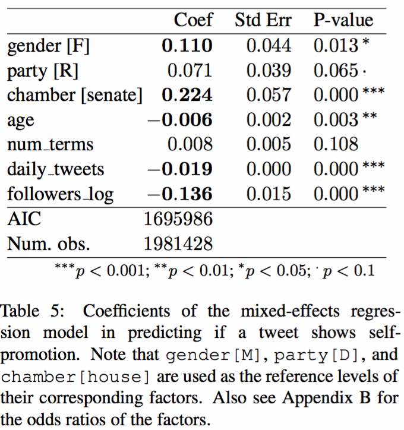
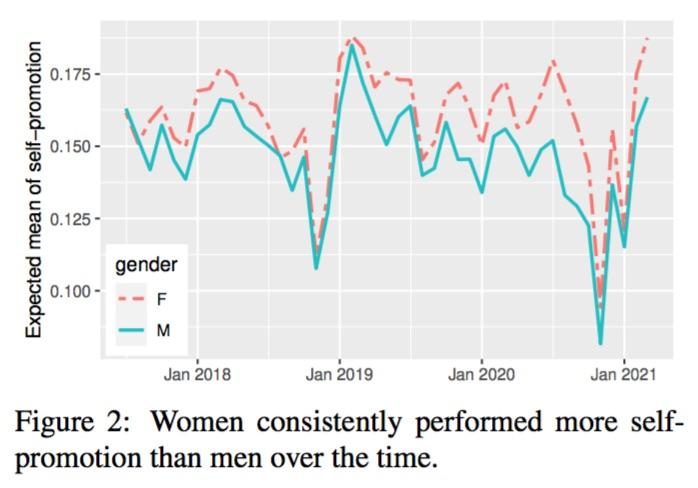

# Self Promotion in US Congressional Tweets

#### How to cite ####
Jun Wang, Kelly Cui, and Bei Yu (2021). 
Self Promotion in US Congressional Tweets.
NAACL-HLT'2021.
June 6-11, 2021, online.
[Download PDF](https://github.com/junwang4/self-promotion-in-congress-tweets/blob/main/document/NAACL2021_self_promotion_in_congress_tweets.pdf)

```
@inproceedings{wcy2021selfpromotion,
  title={Self Promotion in US Congressional Tweets},
  author={Wang, Jun and Cui, Kelly and Yu, Bei},
  booktitle={Proceedings of NAACL-HLT'2021},
  year={2021}
}
```


## Get started

**NOTE**: My running environment is **Linux box (Ubuntu 16.04) with a 1080Ti GPU**.

### STEP 1. Prerequisite

Install bert-sklearn --
a scikit-learn wrapper to finetune BERT model based on the Huggingface's pytorch transformer.
```
git clone -b master https://github.com/charles9n/bert-sklearn
cd bert-sklearn
pip install .
```

Install other packages
```
pip install fire
```


### STEP 2. Get the repo, including code and data
```
git clone https://github.com/junwang4/self-promotion-in-congress-tweets
cd self-promotion-in-congress-tweets
```

### STEP 3

#### 3.1 To evaluate the performance of the model, say, 5-fold cross-validation 

First, generate a prediction file as the result of training and testing each of the 5 folds
```
python run.py tweet_classifier --task=train_KFold_model
```
This will take as input the annotated dataset `data/annotations.csv`,
and assemble the prediction results from each fold into `code/working/pred/[20210331]_train_K5_epochs3.csv`

Second, display the evaluation results

```
python run.py tweet_classifier --task=evaluate_and_error_analysis
```
In the case of using the default setting given in file `code/settings.ini`,
we have the following result:
```
              precision    recall  f1-score   support

           0      0.951     0.949     0.950      3089
           1      0.828     0.835     0.831       914

    accuracy                          0.923      4003
   macro avg      0.889     0.892     0.890      4003
weighted avg      0.923     0.923     0.923      4003

```

#### 3.2 Create a fully-trained BERT model to classify a tweet as self-promoting or not
```
cd code
python run.py tweet_classifier --task=train_one_full_model
```
This will take as input the annotated dataset `data/annotations.csv`,
and output a BERT model at `code/working/model/[20210331]_full_epochs3.bin`


#### 3.3 Apply the above trained model to the 2 million tweets 

```
python run.py tweet_classifier --task=apply_one_full_model_to_new_sentences
```
This will take as input the file `data/sample_tweetid_bioid_text.csv`, 
and output a prediction csv file in folder `code/working/pred/[20210331]_apply_epochs3.csv`

The file `data/sample_tweetid_bioid_text.csv` is only a random sample of 1000 tweets.

If you are interested in diving into the tweet content and other information of the 2 million tweets used in our paper,
use the tweet IDs in file `data/tweet_ids_all.dat` to `hydrate` the tweets.

To do that, first 
install [twarc](https://twarc-project.readthedocs.io/en/latest/),
a command line tool and Python library for archiving Twitter JSON data;
second, setup a Twitter developer account (consumer_key, consumer_secret, access_token, access_token_secret)
for running `twarc`.

Then, run the following command by replacing `{tweet_ids_file}` with 
`data/tweet_ids_all.dat`, and replacing `{fpath_out}` with the filename you plan to save the data
```
twarc hydrate {tweet_ids_file} > {fpath_out}
```
Note that it may take half a day and 10GB storage space to *hydrate* the 2 millions tweets.


### STEP 4. Logistic Linear Mixed-effects Regression Analysis in R
(I wish there was such a package of `generalized linear mixed-effects regression` in Python)

Open your Rstudio, and load the R markdown file `code/regression_analysis.Rmd`,
which contains the instructions of how to run the regression analysis as well as the 
diagnosis of the [key assumptions of linear regression](https://www.youtube.com/watch?v=0MFpOQRY0rw&list=PLily2kOoFdaCiyDq3K5D9nP5OQQYbG4nl&index=2).

The above analysis needs to read  `data/final_data_for_regression_analysis.csv`. 
This data was generated by combining 2 million tweet predictions with their authors' various attributes
```
self_promotion_as_predicted_by_BERT_model,bio_id,date,chamber,party,gender,age,followers_log,num_terms
0,K000377,2020-12-03,senate,D,M,57,13.288,2
1,K000377,2020-12-05,senate,D,M,57,13.288,2
```

## Excerpts from the paper
<p float="left">




</p>
